# Impacto de la tasa de pérdida de paquetes en los tiempos de descarga del Sitio Web: Banderas

## Con una tasa de transferencia de 1 Mbps
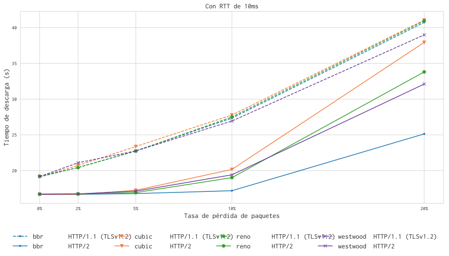
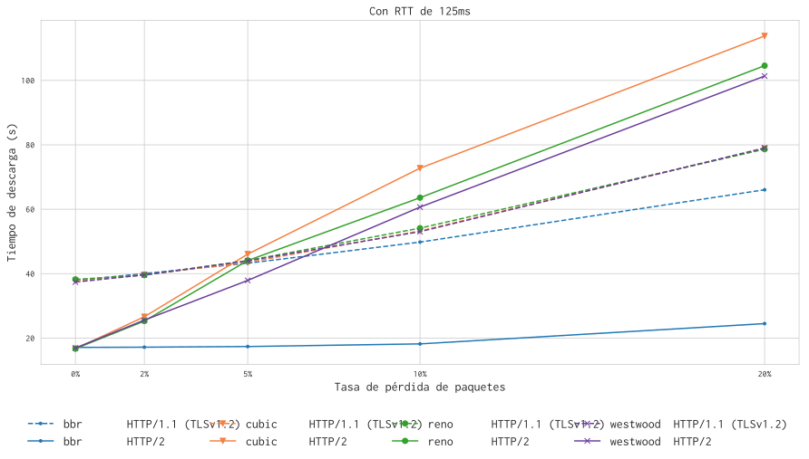

## Con una tasa de transferencia de 5 Mbps
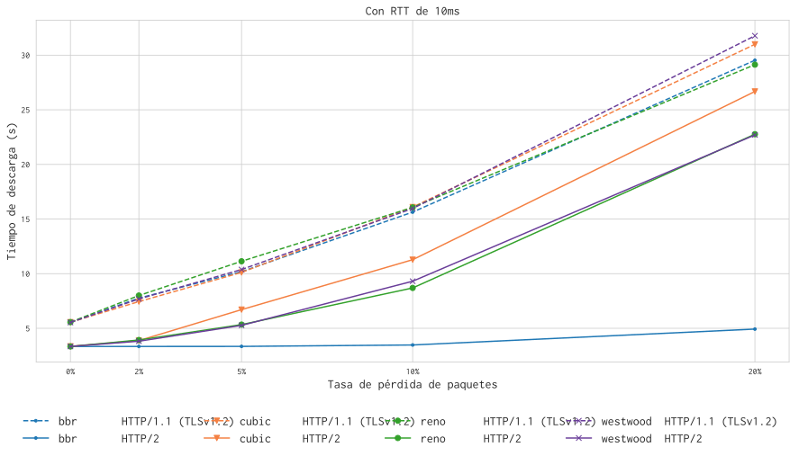
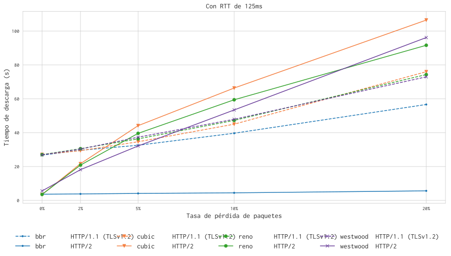

## Con una tasa de transferencia de 20 Mbps
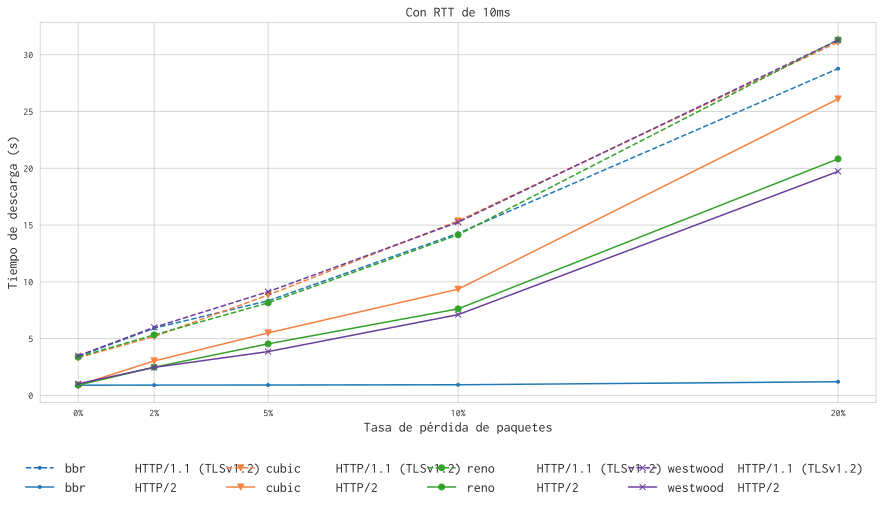
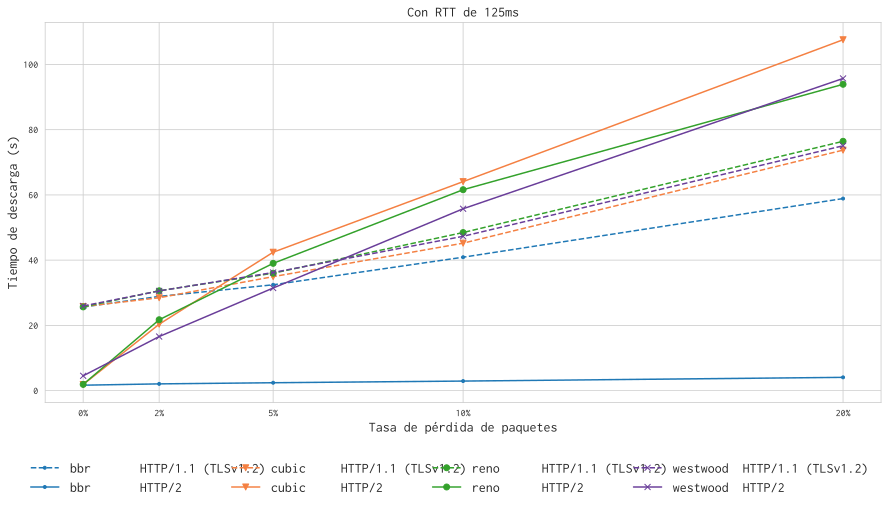

# Impacto del RTT en los tiempos de descarga del Sitio Web: Banderas

## Con una tasa de transferencia de 1 Mbps
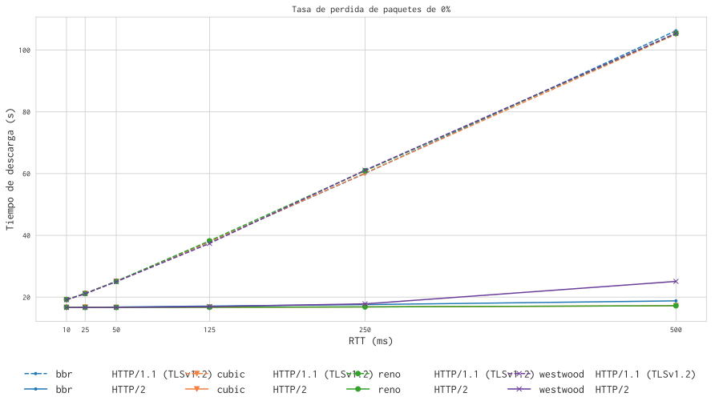
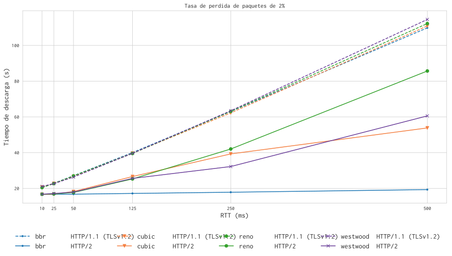
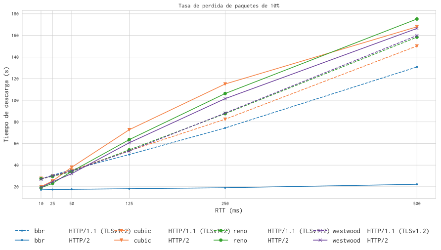

## Con una tasa de transferencia de 5 Mbps
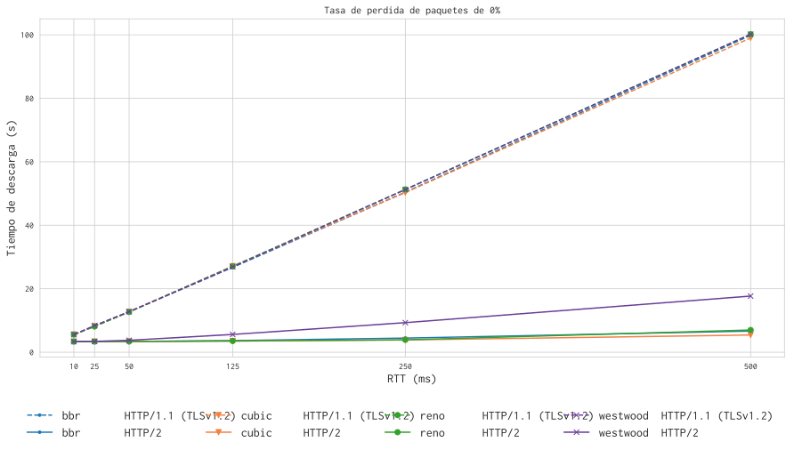
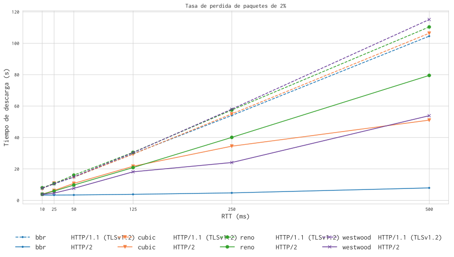
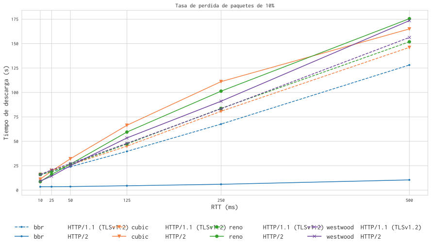

## Con una tasa de transferencia de 20 Mbps
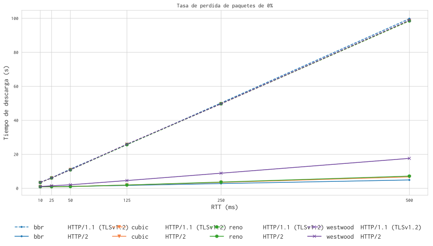
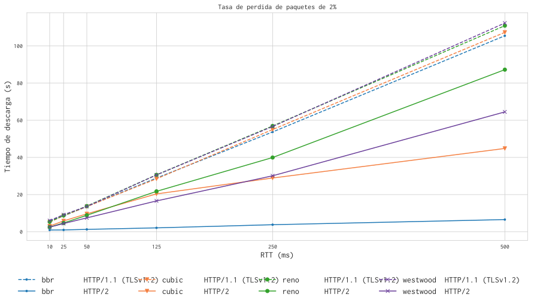
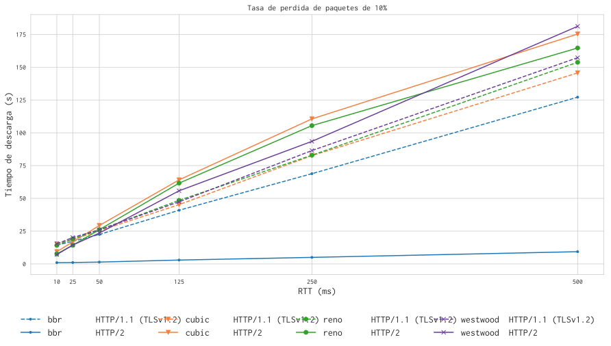

# Recomendaciones sobre la combinación con mejor rendimiento

## Utilizando solamente las implementaciones que vienen por defecto en Linux

